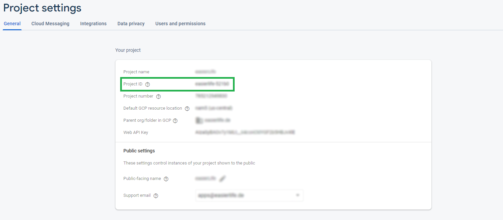
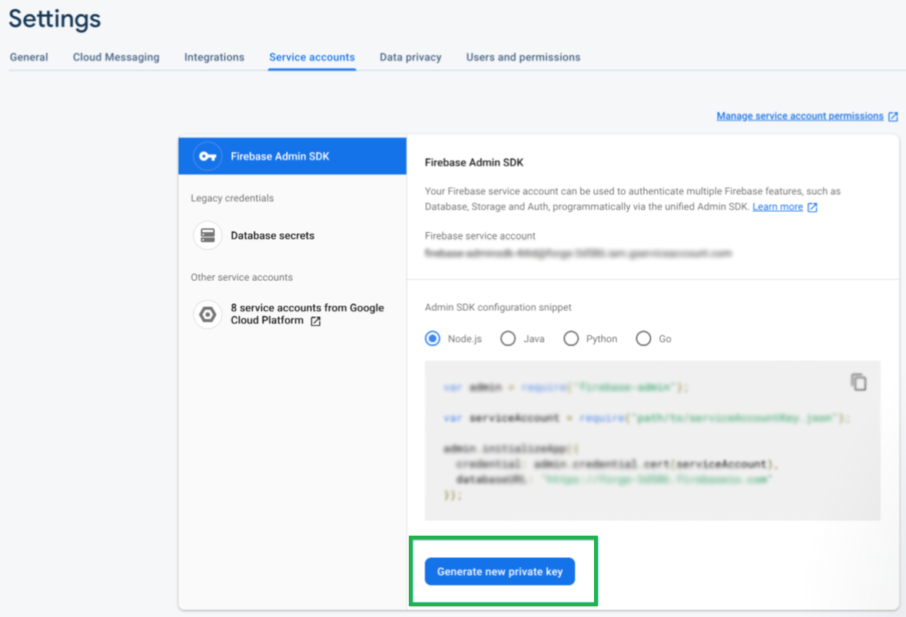
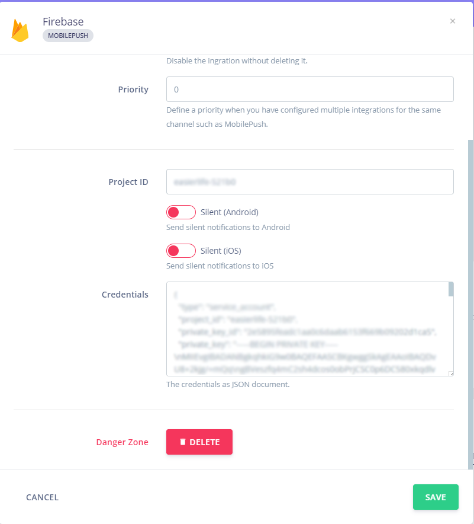

# Configure Notifo app
### **1. Get Firebase Project ID, and Service Account Details**

You can find your Project ID in the Settings page of your Firebase account.  

You can find your Firebase Service Account Details under the "Service accounts" section of your Firebase Settings page. Click the "Generate new private key" button to download a file containing your Service Account details.  

### **2. Add Firebase Project ID, and Service Account Details to Notifo**
In Notifo go to More -> Settings and paste your Project ID and Service Account Details in the appropriate fields and click Save.

